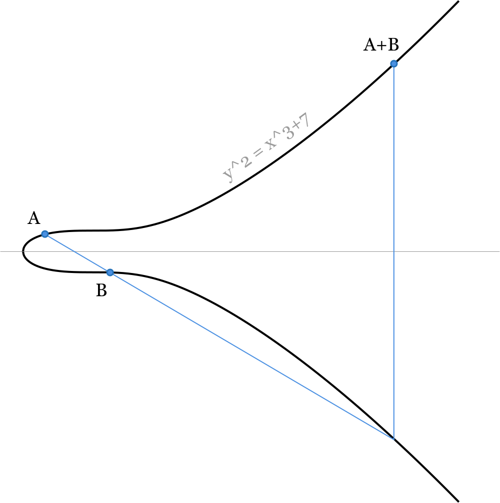
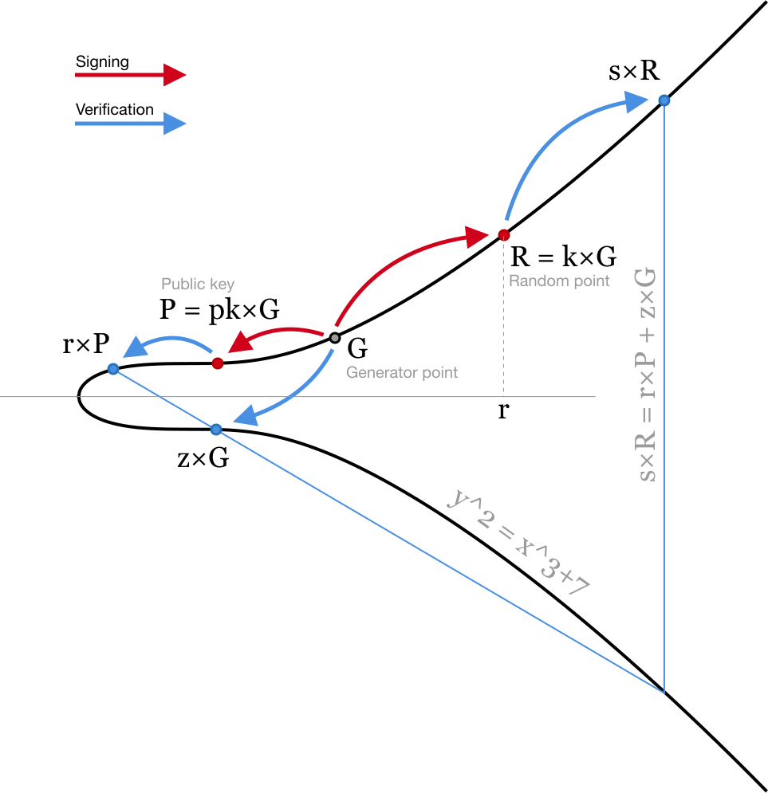
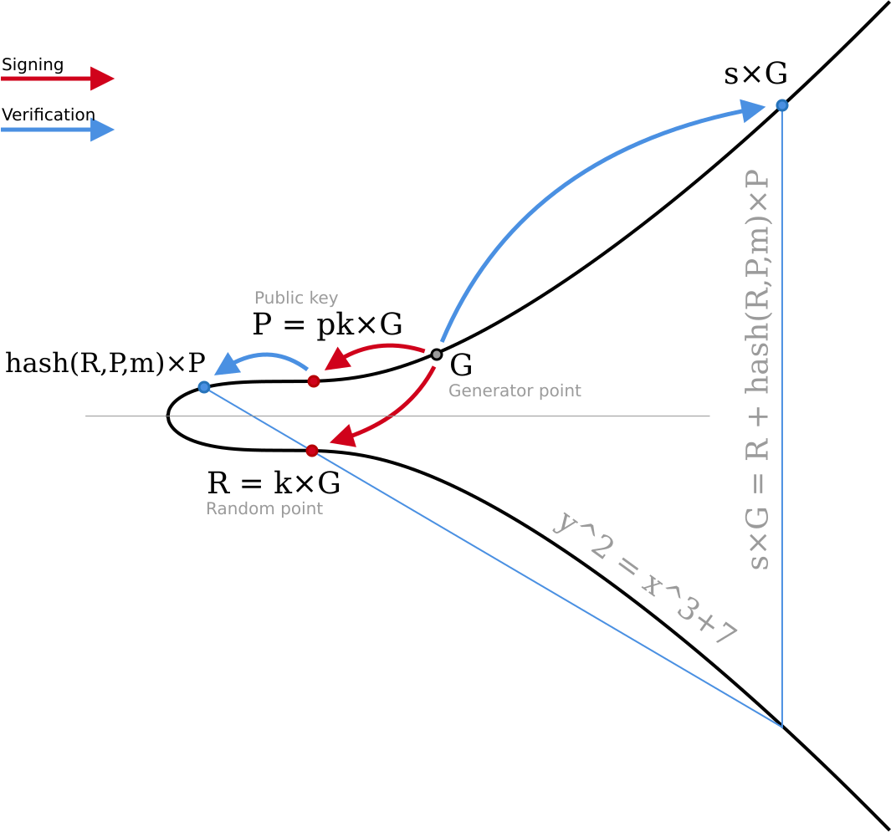
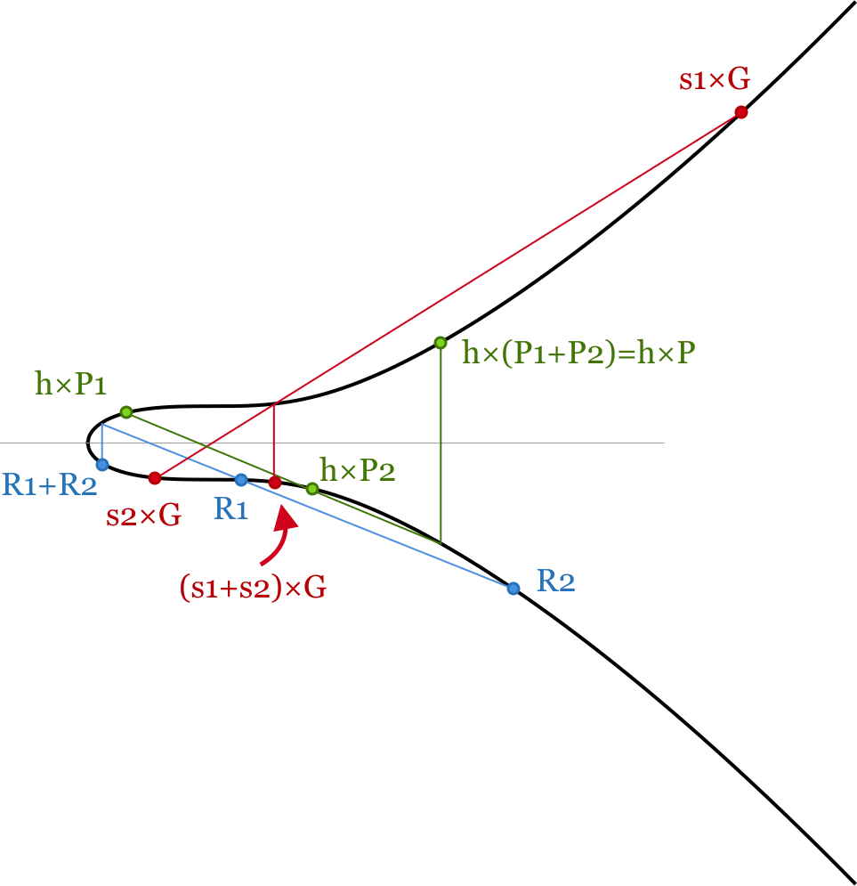
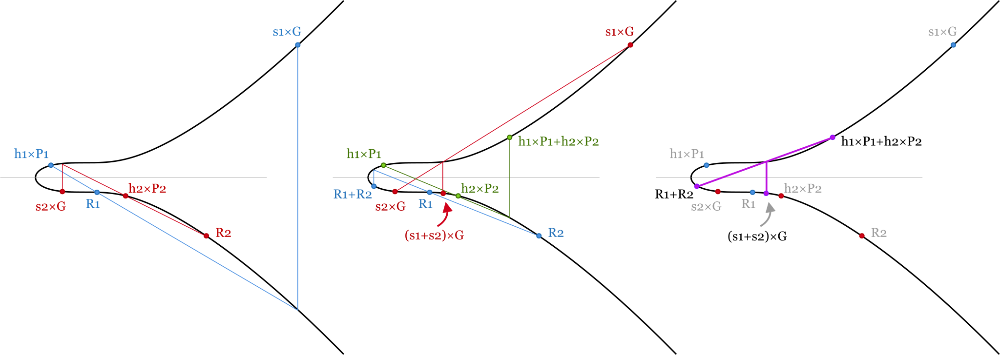
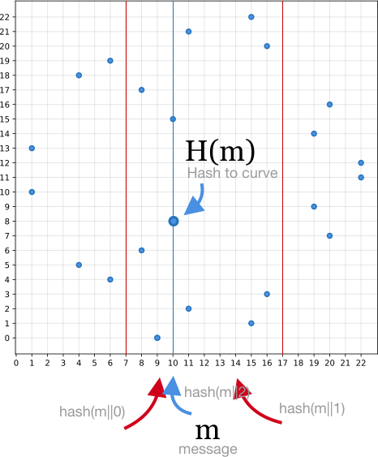
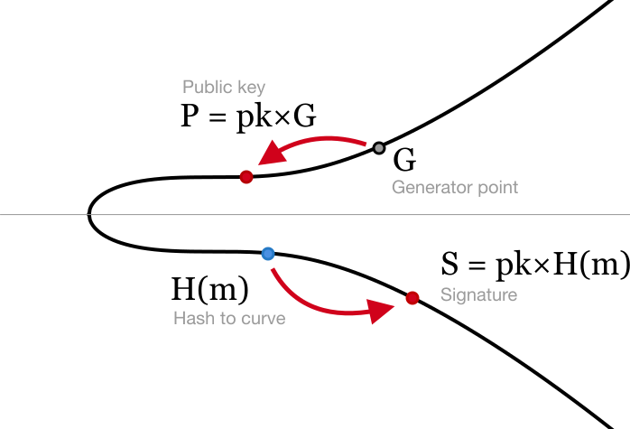
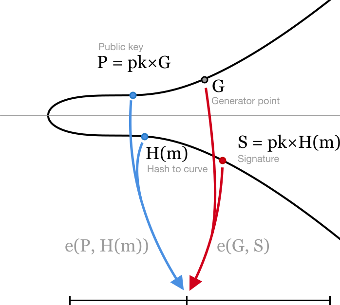

# eccpics

Elliptic curve illustrations for my blog posts. Feel free to use however you want.

Normally I use "Georgia" font for equations and "Helvetica Neue" for notes and labels.

Every image has two versions - `something_text.svg` and `something_outlines.svg`. They are stored in corresponding folders. Outline versions are larger but don't need fonts installed - text is converted to curves, but editing of the text on these images is not possible.

`ecdsa.sketch` contains all images in sketch how I originally drew them. Also with text or as outlines for every page.

## Images:

Here I linked to images with outlines.

### ECC addition (`ec_add_*`)

### ECDSA (`ecdsa_*`)

### Schnorr signatures (`schnorr_*`)

### Key aggregation (`key_agg_*`)

### Batch validation

### Hash to curve

### BLS signing (`bls_sign_*`)

### BLS verification (`bls_verify_*`)

